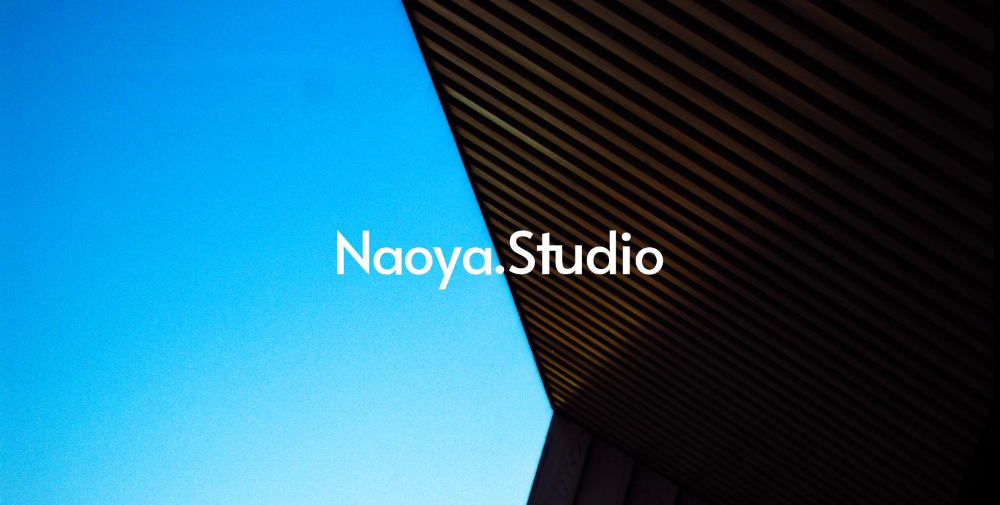
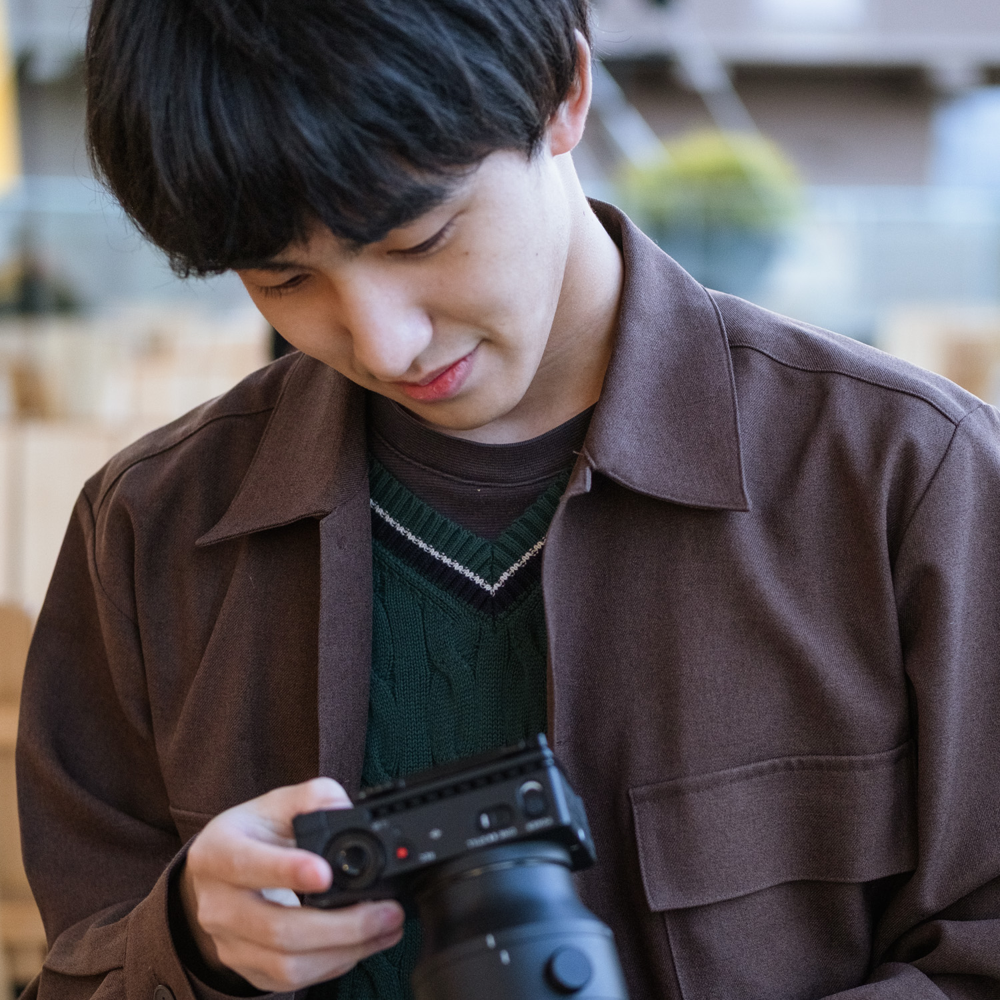

  

### 👋 About

<table>
  <tr>
    <td width="180" valign="middle" align="center">
      
    </td>
    <td valign="top">
      

        <b>Name</b>: Naoya 
        <b>Location</b>: Japan 
        <b>Interests</b>: camera / gear, consumer electronics & PCs, music & audio
      

      

        I’m a self-learning developer, exploring how to mix my favorite things with code. 
        Right now I’m focused on building small, sharp projects and leveling up step by step.
      

    </td>
  </tr>
</table>

---

### 🧰 Tech Stack

#### Development

  
  
  
  
  
  
  

#### Design

  
  
  
  

#### Creative

  
  
  

---

### 📊 GitHub Stats

  

  

  

---

### 🎯 What I Want to Build

- Simple but useful tools for photographers, gadget lovers and music fans
- Clean, minimal UIs with a focus on experience
- Projects that help me grow as an engineer, one commit at a time
